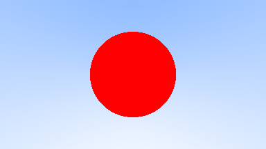
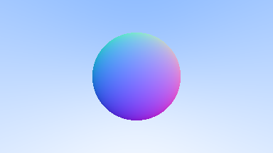

## Raytracing in One Weekend に One Weekend 以上かけてノロノロと取り組む

**記録**

### 1日目  
画像を表示しただけ  

### 2日目  
vec3, ray クラスなどを定義しただけ  

### 3日目  
ビューポートのy座標に基づいてグラデーションを画像を表示  

### 4日目  
レイと球の交差判定をして、ビューポートに投影  
  
 
法線を計算して可視化  
  