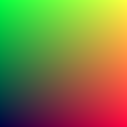
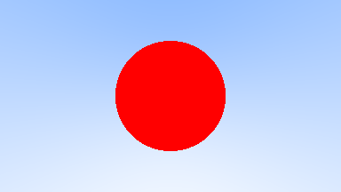
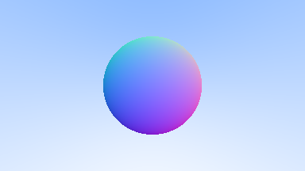
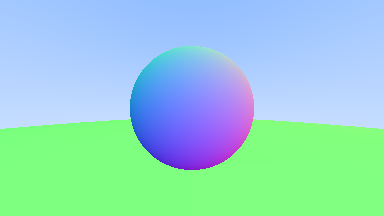
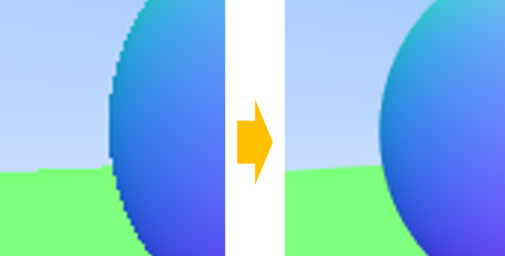
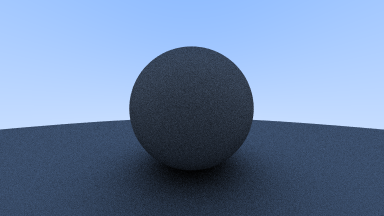
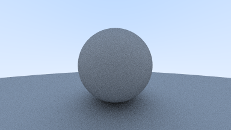
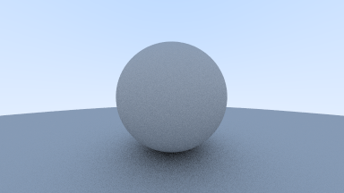

## Raytracing in One Weekend に One Weekend 以上かけてノロノロと取り組む

**記録**

### 1日目  
画像を表示しただけ  

### 2日目  
vec3, ray クラスなどを定義しただけ  

### 3日目  
ビューポートのy座標に基づいてグラデーションを画像を表示  

### 4日目  
レイと球の交差判定をして、ビューポートに投影  
  
 
法線を計算して可視化  
  

### 5日目
衝突可能オブジェクトの抽象化, 球の位置の可視化 

 

カメラクラスを定義

アンチエイリアス 

拡散反射球の表示 

### 6日目

ガンマ補正適用 

シャドウアクネ削除 
